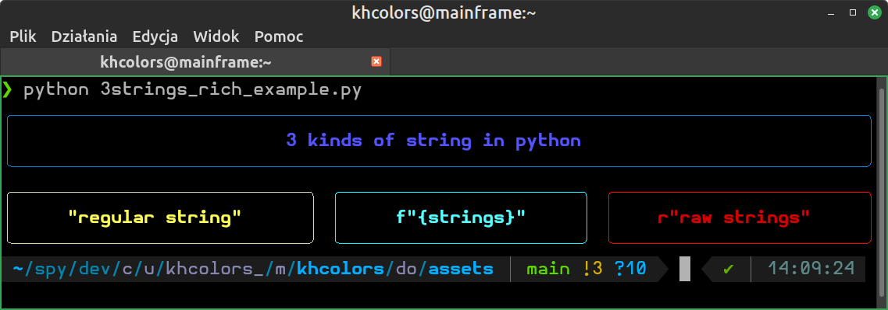

1. Background and reason.

    - Provide multiple examples and approaches of how to work with it

During data visualization with `matplotlib`, in the form of plots of various
types, choosing colours is essential. It is obvious that different lines
or data series look much better in a single plot when they are represented in 
distinct colours. Additionally, styling the plot and axes titles
may also benefit from the use of colours. When working on a terminal
application, selecting colours is equally important for text formatting.

Remembering the names of colours, such as `red`, `blue`, `green`
or `yellow` is straightforward and typing those names is generally
not cumbersome. However, even a diligent and meticulous researcher, or
programmer can become weary of repeatedly selecting the same colours, and would
get a bit tired of picking the same colours all the time,
typing them repeatedly and, in the end, and ultimately becoming bored with
the same shades.

The issue becomes particularly problematic if the author stumbles upon
a colour table, containing **148 different shades** from the `CSS4` set,
or **235** items in the `rich` palette. In such a case 1) it becomes evident
that there are, literally, tens or even hundreds, of possible choices, and 2)
a larger number of colours results in longer names, which means longer
strings to remember and type (when the risk of errors also increases).

All of the above gave an impulse to create an application[^1] designed to
assist in selecting colour names and inserting them into code. The author's
recent fascination with applications that operate in terminal emulators
resulted in the `khcolors` project.

## `matplotlib` example

Possibility of application of the `khcolors` program while working with
`matplotlib` is illustrated with an example file, plotting 3 curves. Each of
the plotted data series had its own colour. To stress the value of a helping
utility for choosing colour names, the axes legends and plot labels were
assigned with different colours. Such an approach resulted in 6 colour names
(lines `6-11`; when a certain colour value was to be specified, it was done
through these variable names, obviously, lines `22-24, 27, 28` and `39`).

```python hl_lines="6-11 22-24 27-28 39" title="cos_sin_x.py" linenums="1"
--8<-- "docs/assets/cos_sin_x.py"
```

The script resulted in the following plot:

<figure>

</figure>

In case of each of the colour variables, the name of the colour can be
conveniently chosen simply by typing in the terminal:

```bash
$ khcolors <colour_name> -c
```

and choosing the desired colour shade, e.g.

<figure>

</figure>

When many colour names are needed, the full `rich` or `CSSR` colour spectrum
presented with the application might prove useful.

## `rich` example

The application of `rich` colour palette with `khcolors` is illustrated with
a simple example of a script generating 4 different panels.
Colours for the contents of each panel were defined in lines `11-16`.
Colours of the border of each panel was chosen of a different shade (lines `18-23`).

```python hl_lines="11-16 18-23 39" title="cos_sin_x.py" linenums="1"
--8<-- "docs/assets/3strings_rich_example.py"
```

The result is presented in the following figure (line `39`):

<figure>

</figure>


[^1]:While it is indeed possible to remember all the names of colours,

    such an approach in the end would require more typing (with higher
    risk of mistakes), and... more typing.
