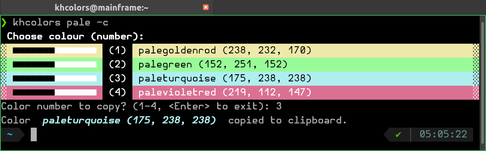
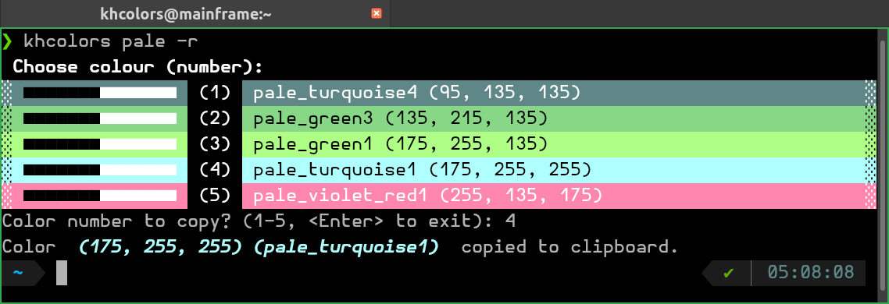
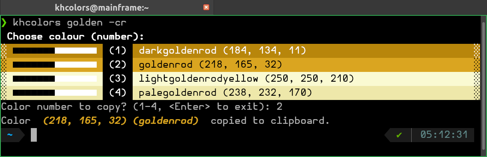

## How To Print All The Colours?

There are 2 colour palettes available in the `khcolors`: `rich.color.ANSI_COLOR_NAMES` and `matplotlib.colors.CSS4_COLORS`. To print all
the colours from a palette, simply type `khcolors`, without any name. Without
any options, the user is asked if all 235 colours from the `rich` palette
should be printed. If `-c` is provided, the application will ask if all of
148 CSS4 colours should be printed.

## How To Choose Between `rich` and `matplotlib` Palettes?

As it was briefly mentioned in the [Tutorials - {{ tutorials_getting_started }}](tutorials.md#basic-usage-options), `khcolors`currently covers
2 palettes: `rich.color.ANSI_COLOR_NAMES` and `matplotlib.colors.CSS4_COLORS`.
The default palette is `rich`; to get the list of different names
for a particular colour or shade, e.g. `pale` or `pink`, just type

    khcolors <searchd_color_shade>

If you want to switch to
the `matplotlib` palette, simply use the  `-c` | `--css` option, e.g.

    khcolors <searchd_color_shade> -c

<figure>

</figure>

## How To Copy to Clipboard an `RGB` Tuple

`khcolors` by default copies to clipboard the name of the chosen colour
 ([Tutorials - {{ tutorials_getting_started }}](tutorials.md#basic-usage-options)). To copy `RGB` tuple, use option `-r` | `--rgb`:

`khcolors <searchd_color_shade> -r`, e.g.

<figure>

</figure>

To combine both flags (i.e. to select `CSS` palette and copying `RGB` tuple),
for, e.g. golden, it is possible to type

`khcolors golden -cr`:

<figure>

</figure>

## How To Copy More Than One Colour

To copy more than one colour of the presented search result list,
it is possible to simply type the numbers of chosen colours,
separated either with spaces or commas. All the colours can be chosen
with `.` or `*`.

<figure>

</figure>

(In the example figure above, for case of 3 separate colours and all
the shades of olive, the result, copied to the clipboard,
was pasted after `#`.)
