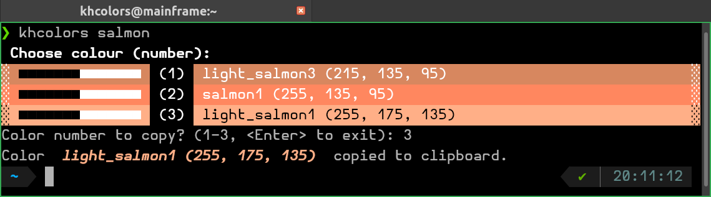

## {{ tutorials_getting_started }}

The application was designed primarily for use in the terminal. After
[installation](#installation-footnote), it is possible to simply type `khcolors --help` in the terminal.

- Basic usage

    - `TL;DR`

        - Go to the terminal, type `khcolors <color> [options]`,
        - Choose a colour number from the list presented -- the chosen colour
        will be copied to the clipboard.

        <figure>
        
        </figure>

        <!--  -->

    - details:

        - the `<color>` to look for can be a base name of a colour, e.g.
        `green`, `cyan`, etc., or it can be just a part of the name,
        e.g. `blu` or `light`, `dark`, `spring`, `deep`, `sky`, etc.

        <figure>
        
        </figure>

        - if `<color>` is a name of the palette \(`base` or `base-bright`),
        whole chosen palette will be printed.

        <figure>
        
        </figure>

        - after being presented with the list of colours, you can simply
        select the chosen shade with the number from the list.

        <figure>
        
        </figure>

        - if `<color>` does not exist in the palette, e.g. `lightbright`, the
        application exits with a message
        `No color found for 'lightbright', exiting.`

    
    - options:

    - `-c` / `-css`: prints the list of colours from the `CSS4` palette
    (the default palette is `rich`).
    - `-r` / `-rgb`: the chosen colour is copied as an `(r, g, b)` tuple
    \(default is the colour name).

    <figure>
    
    </figure>

---

**Installation**
[↩](#getting-started)

1. The package can be install with `pip`:

    * `python -m pip install khcolors`

    or

1. cloned from the github repository:

    * `git clone https://github.com/pykhaz/khcolors.git` (in the terminal)

    or

1. downloaded from the repository archive:

    * Go to [github.com/pykhaz/khcolors](https://github.com/pykhaz/khcolors)
    and download the archive of repository
    (menu button "<> Code" -> "Download ZIP").

    * Unzip the archive: `unzip khcolors-main.zip`

1. and installed:

    * `cd` into `khcolors` (if cloned), or `hcolors-main` (if downloaded).

    * install the package: `python -m pip install .`
